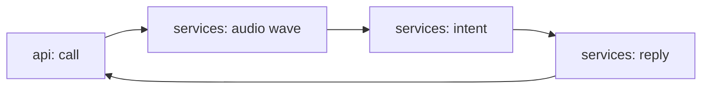

# voice-agent-support

[](https://github.com/Shamanchi/voice-agent-support/actions/workflows/ci.yml)
[](https://www.python.org/)
[](./Dockerfile)
[](./LICENSE)

> **English TL;DR:** FastAPI voice-support agent: real WAV metadata parsing (stdlib `wave`), transcript intent classification and short spoken-style replies with TTS time estimates. Fully offline, no tokens needed.

Голосовой агент поддержки: реальный разбор WAV-заголовков (stdlib `wave`), классификация интента по транскрипту и короткие разговорные ответы с оценкой времени озвучки. Работает офлайн.

Источник темы: `Hands-On-AI-Engineering / P-146 (audio/customer_support_voice_agent)` — идею и постановку взяли из каталога, код и тексты написаны с нуля.

## Какую задачу решает

Нужно обслуживать голосовые обращения без облачных STT/TTS: агент принимает аудио (читает длительность/каналы) и/или готовый транскрипт, определяет интент, готовит короткий ответ для озвучки и оценивает его длительность.

## Архитектура



Слои: `api/` → `services/` → `core/`, настройки через `pydantic-settings`.

## Быстрый старт

```bash
cp .env.example .env
pip install -r requirements.txt
uvicorn app.main:app --reload
curl -X POST http://127.0.0.1:8000/api/v1/call -H "Content-Type: application/json" -d "{\"transcript\": \"My bill is wrong, help\", \"caller\": \"Ann\"}"
```

Docker:

```bash
docker compose up --build
```

## API

- `GET /api/v1/health` — проверка сервиса.
- `POST /api/v1/audio-info` — метаданные WAV (multipart). Ответ: `duration_sec`, `channels`, `sample_rate`.
- `POST /api/v1/call` — звонок. Тело: `{"transcript": "...", "caller": "Ann"}` или multipart `audio` + `caller`. Ответ: `intent`, `confidence`, `reply`, `tts_estimate_sec`, `audio` (метаданные, если было аудио).

Пример ответа `call` (сокращённо):

```json
{
  "intent": "billing",
  "confidence": 1.0,
  "reply": "Ann, I hear you about the bill...",
  "tts_estimate_sec": 4.2
}
```

## Переменные окружения (.env)

| Переменная | Назначение | По умолчанию |
|---|---|---|
| `CHARS_PER_SEC` | Символов в секунду для оценки TTS | `15.0` |
| `MAX_AUDIO_MB` | Макс. размер аудио (МБ) | `10` |
| `APP_HOST` / `APP_PORT` | Хост/порт API | `0.0.0.0` / `8000` |

Полный список — в [.env.example](./.env.example).

## Тесты

```bash
pip install -r requirements.txt
pytest -q
pytest -q -m integration
```

Unit-тесты без сети (WAV генерит stdlib `wave`). Интеграционные (`-m integration`) — через TestClient, тоже без сети.

## Контакты

- Telegram: @PavelYrevichh
- Email: Lietman46@mail.ru
- GitHub: Shamanchi
- FL.ru: https://www.fl.ru/users/Shamanchi
